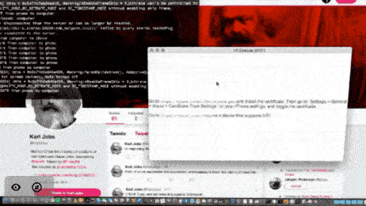

# Vdisplay

This is an Electron-based (eww!) app that lets you use a VR HMD mount to view a representation of your computer desktop in Virtual or Augmented reality - by opening a website on your phone.

It does this using WebVR and WebRTC.

The current implementation is just a POC; it has only been tested on a MacBook Air (1440 x 900) and an iPhone 6S (1334 x 750)

The motivation behind this was to have a wireless VR representation of my desktop (as I don't own a dedicated VR headset - only an iPhone and a HMD mount that accompanied a Mambo Parrot drone).




# Dev

TODO:
- Try to always have a connection to the server, i.e. retry on disconnect
- Retrigger content selector on disconnect
- On mobile disconnect: remove remote stream
- Port VR operations to raw THREE.js or A-Frame
- Rotate device/camera feed on screen rotation
- AR mode
- Autogenerate new certificate on build
- Handle sound?


Interesting links:

[HTTPS](https://medium.freecodecamp.org/how-to-get-https-working-on-your-local-development-environment-in-5-minutes-7af615770eec)

[SSL / CA](https://support.securly.com/hc/en-us/articles/206978437-How-to-deploy-Securly-SSL-certificate-to-iOS-)

[Kinda inspiring](https://github.com/brianpeiris/RiftSketch)

based on [electron-boilerplate](https://github.com/szwacz/electron-boilerplate) and [Web VR Starter Kit](https://github.com/povdocs/webvr-starter-kit)


# Structure of the project

The application consists of two main folders...

`src` - files within this folder get transpiled or compiled (because Electron can't use them directly).

`app` - contains all static assets which don't need any pre-processing. Put here images, CSSes, HTMLs, etc.

The build process compiles the content of the `src` folder and puts it into the `app` folder, so after the build has finished, your `app` folder contains the full, runnable application.

Treat `src` and `app` folders like two halves of one bigger thing.

The drawback of this design is that `app` folder contains some files which should be git-ignored and some which shouldn't (see `.gitignore` file). But this two-folders split makes development builds much, much faster.


# Development

## Starting the app

```
npm start
```

# Making a release

To package your app into an installer use command:
```
npm run release
```

Once the packaging process finished, the `dist` directory will contain your distributable file.

We use [electron-builder](https://github.com/electron-userland/electron-builder) to handle the packaging process. It has a lot of [customization options](https://www.electron.build/configuration/configuration), which you can declare under `"build"` key in `package.json`.

You can package your app cross-platform from a single operating system, [electron-builder kind of supports this](https://www.electron.build/multi-platform-build), but there are limitations and asterisks. That's why this boilerplate doesn't do that by default.
